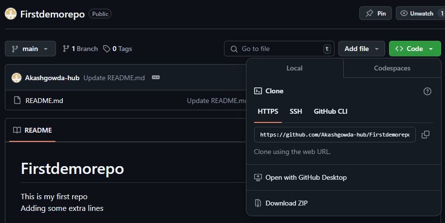

# First Demo Repo

This is my first repository.
 
**Author:** Akash Gowda

---

### Steps Followed:

1. **Started using Git**  
   I created my first Git repository via the GitHub website and selected the option to add a `README.md` file.

2. **Installed VSCode & Git Bash**  
   I installed both **Visual Studio Code (VSCode)** and **Git Bash** on my local machine.

3. **Verified Installation**  
   I ran the following command to check if Git was installed successfully:  

   git --version
4. **Created a Local Folder**
  On my local machine, I created a folder where all my repositories will be stored.

5. **Cloned the Repository**
   In the VSCode terminal, I used the following command to clone my GitHub repository to my local machine: 
   git clone https://<your-repository-link>.git 
    
   You can find this HTTPS link by clicking on the Code button in your GitHub repository. 

6. **Useful Commands:**
   List the directory contents: ls  
   List all contents, including hidden files (Git Bash/Linux): ls -a  
   List all contents, including hidden files (VSCode/Windows):Get-ChildItem -Force  
   Check the status of your code (any changes made in the Git repository):git status  

7. **Additional Notes:**
   When cloning the repository, the entire repository with all files (including hidden files like .git) will be copied to your local machine.  
   If you want to see hidden files or folders in Windows using VSCode, ensure that you have enabled Show Hidden Files in the file explorer sidebar.  
  
   That's it! You've successfully created your first GitHub repository and cloned it to your local machine. Feel free to add more content and explore Git further.  

8. **Git Status Command Explained:**
  "Untracked files:"
  This shows new files that Git isn't tracking yet.
  
  "modified:"
  These are files that have been changed since the last commit.
  
  "staged:"
  These files are ready to be committed.
  
  "unmodified:"
  These files have not changed since the last commit.

9. **Git Add, commit & Push:**

  A. ****Add Files:**
  To add new or changed files in your working directory to the Git staging area, use:
   git add <filename>
  
  To add all files at once:
  git add .
  
  B. **Commit Changes:**
  To record changes and create a commit, use:
  git commit -m "your commit message"
  
  C.**Push Changes:**
  To upload your local repository content to the remote repository, use:
  
  git push origin main

10. **Init cmd**

  Init is used to create a new Git repo
  
  git init : initializes a new Git repository, creating a .git directory where Git will store all of its information about the repository.
  git remote add origin <link> : associates your local repository with a remote repository, allowing you to push and pull code to and from a service like GitHub.
  git remote -v : shows the remotes associated with your repository (both fetch and push).
  git branch : lists all the local branches in the repository.
  git branch -m main : renames the current branch to main. (Note: It's commonly used to switch to the main branch from an older default branch name like master.)
  
  Once init cmd is executed, you have to create a remote repo, which can be done in two ways: Using CLI and GUI. The above steps were done using GUI.

**Steps for CLI:**

  1. Install Git CLI on your local system.
  
  2. Check CLI version: gh --version
  
  3. Authenticate with Git CLI: gh auth login
  
  4. Run the following command to create a remote repo from CLI: "gh repo create <github-localrepo> --public --confirm"

  For additional help, use the Git CLI docs.

  Once the repo is created, run the following command to link the remote repo with the current folder and files:
  git remote add origin "https://github.com/your-username/<repo-name>.git"
  Once confirmation is received, use add, commit, and push commands to update your local files/repo to the remote repo.

11. **Git Branch**

  git branch : lists all the local branches in the repository.
  git branch -m main : renames the current branch to main. (Note: It's commonly used to switch to the main branch from an older default branch name like master.)
  git checkout <branchname> : Switches to an existing branch.
  git checkout -b <newbranchname> : Creates a new branch and switches to it.
  git branch -d <branchname> : Deletes a branch locally.

  Note: This command deletes the specified branch from your local repository. You must ensure that the branch you're deleting is not the branch you're currently on (if you are on         the branch, Git will prevent you from deleting it).
  
12. ** Merging code**

  git merge <branchname> :The git merge command is used to combine the changes from one branch into another.

  Example: If you are on the main branch and want to merge a branch called feature-xyz into it, you would run:
  git merge feature-xyz
  
  git diff <branchname> : To compare commits,branches, files & more
 
13. **Fork**
    
  A fork is a copy of someone else's repository (repo) that you can modify freely without affecting the original repo.
  commonly used in open-source projects.
  Example: You fork a project on GitHub, and now you have your own copy of the code to edit and make changes.

14.  ** Pull Request (PR) **
  A Pull Request (PR) is a way to ask someone to review and merge your changes into their repository. You "request" to have your changes merged by the project maintainers.
  Example: You make changes in your forked repo, and when you're ready, you create a PR to propose these changes to the original repo.

15. ***Delete the Most Recent Commit Locally and Remote (Hard Reset)***

   "git reset --hard HEAD~1"

  --HEAD~1 refers to the previous commit (one commit before the current)
  --hard means you want to reset both your working directory and the commit history.
  
  16. **Push the Changes to the Remote Repository**
  
   "git push origin main --force"

   git reset <file>: Unstages changes that have been added to the staging area.
   git reset HEAD~1: Undo the last commit but keep the changes in your working directory.
   git reset <commit-hash>: Reset your HEAD to a specific commit, keeping changes in your working directory but unstaged.
   git reset --hard <commit-hash>: Completely discards all changes and resets your repository to a specific commit (destructive).

